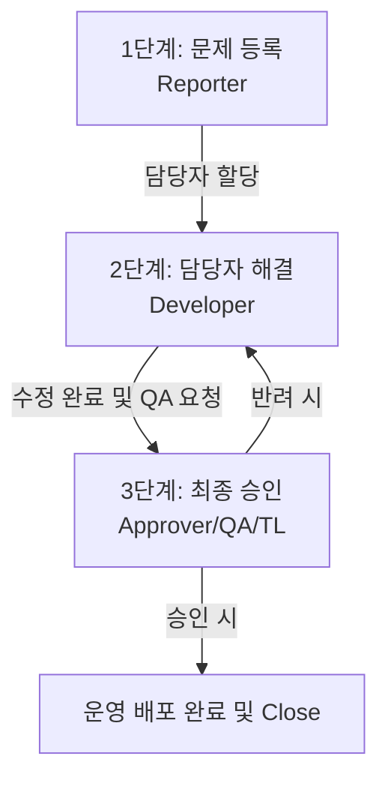

# iStaging Production Issues 🚨

이 저장소는 **iStaging**에서 개발/운영 중인 프로덕션 환경의 이슈들을 기록하고 체계적으로 관리하기 위한 저장소입니다.

모든 프로덕션 이슈는 서비스 안정성을 위해 **3단계 절차(문제 등록 ➡️ 담당자 해결 ➡️ 최종 승인)**를 거쳐 투명하게 해결됩니다.

---

## 🔄 이슈 처리 프로세스 (3-Step Workflow)

이슈가 해결되고 프로덕션에 배포될 때까지 담당자가 이슈 본문을 업데이트하며 협업을 진행합니다.

### 1️⃣ 1단계: 문제 등록 (Reporter)
* **목적**: 장애 혹은 버그 상황에 대한 구체적인 현상과 정보 파악
* **주요 작성 항목**: 발생 일시, 영향 범위, 우선순위, 상세 현상, 재현 경로, 에러 로그 및 미디어 첨부

### 2️⃣ 2단계: 담당자 해결 (Developer)
* **목적**: 문제의 근본 원인을 규명하고 패치를 작성하여 검증 환경에 적용
* **주요 작성 항목**: 원인 분석(Root Cause), 조치 사항(Resolution), 수정 Pull Request 또는 커밋 링크, 예상되는 사이드 이펙트

### 3️⃣ 3단계: 최종 승인자 결과 (Approver)
* **목적**: 수정 완료 건을 최종 검증(QA)하고 운영 환경 배포를 승인
* **주요 작성 항목**: 검증 결과 및 성공 시나리오, 최종 검증자(Approver) 정보, 배포 승인 상태(Approved/Rejected), 배포 예정일

---

## 📋 이슈 템플릿 사용 방법

1. 본 저장소의 **Issues** 메뉴로 이동합니다.
2. **New Issue** 버튼을 클릭합니다.
3. **🚨 Production Issue (프로덕션 이슈)** 템플릿을 선택하여 생성합니다.
4. 이슈 진행 단계에 따라 담당자들이 본문을 수정(Edit)하며 필요한 정보를 기록해 나갑니다.
